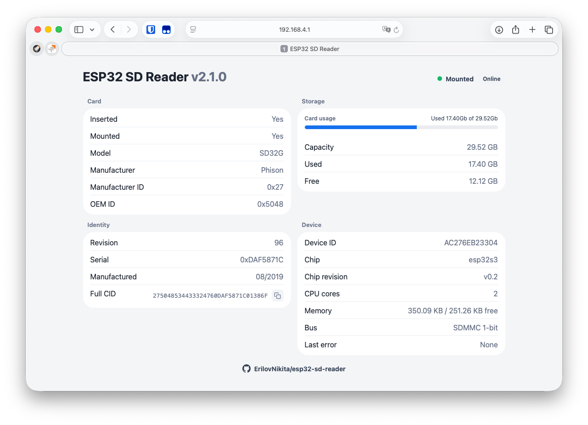

# ESP32 SD READER

[](https://docs.espressif.com/projects/esp-idf/)
[](https://www.espressif.com/en/products/socs/esp32-s3)
[](https://en.wikipedia.org/wiki/C_(programming_language))



ESP32 SD Reader with a built-in Wi-Fi access point and web interface. After flashing, connect to the device Wi-Fi network, open the local status page, and read card status, CID, manufacturer data, storage usage, and ESP32 device information from any browser.

The serial monitor is still useful during startup because it prints the generated Wi-Fi network name, password, and local web address. The main day-to-day workflow is the web interface.

## Features
- Automatic card insert and removal detection.
- CID reading with full CID hex string generation.
- Known manufacturer lookup by Manufacturer ID.
- Capacity, used space, and free space reporting.
- FAT/exFAT support through ESP-IDF FatFs.
- Status indication with a WS2812 addressable RGB LED.
- SDMMC 1-bit bus mode.
- Built-in Wi-Fi access point with a web status page.
- Device information block with ESP32 ID, chip, CPU, and memory details.

## 3D Printed Enclosure Models
This project also includes 3D-printable enclosure models for the device. See the [STL models overview](stl) for previews and version notes:

- [V1 enclosure models](stl/v1) - three-part case with a separate ESP32 holder.
- [V2 enclosure models](stl/v2) - updated two-part case with bottom and top parts.

## Hardware
The project uses SDMMC in 1-bit mode and a dedicated card detect pin.

| Signal | ESP32-S3 GPIO |
| --- | ---: |
| SD CLK | GPIO 12 |
| SD CMD | GPIO 11 |
| SD D0 | GPIO 10 |
| Card Detect | GPIO 9 |
| WS2812 RGB LED | GPIO 21 |

Card Detect is active-low: when a card is inserted, GPIO 9 is expected to read `LOW`.

## LED Status
>[!TIP] 
The web status indicator uses the same color and blinking behavior as the case LED.

| Color | State |
| --- | --- |
| Blue | Device initialization |
| White | Card is not inserted or was removed — slow blinking |
| Yellow | Card detected, mounting in progress |
| Green | Card mounted successfully |
| Red | Mount failed |

## Requirements
- ESP32-S3-based board.
- microSD/SD module wired through SDMMC.
- WS2812 addressable RGB LED, if status indication is needed.
- ESP-IDF compatible with this project.

## Quick Start
Activate the ESP-IDF environment:
```bash
export IDF_PATH="$HOME/.espressif/v6.0.1/esp-idf"
. $IDF_PATH/export.sh
```

Set the target chip:
```bash
idf.py set-target esp32s3
```

Flash the board:
```bash
idf.py flash
```

Open the serial monitor to read the generated Wi-Fi credentials:
```bash
idf.py -p /dev/ttyUSB0 monitor
```

> [!NOTE]
> On macOS, the serial port may look like this:
> ```bash
> idf.py -p /dev/cu.usbmodemXXXX monitor
> ```

To exit the monitor:
```text
Ctrl + ]
```

## Usage
1. Wire the SD module to the ESP32-S3 according to the pin table.
2. Flash the project.
3. Open the serial monitor and copy the Wi-Fi access point name and password.
4. Connect your phone, tablet, or computer to that Wi-Fi network.
5. Open `http://192.168.4.1/` in a browser.
6. Insert an SD card.
7. Read the card information in the web interface.
8. Use the auto-refresh toggle if you want to pause live updates.
9. When the card is removed, the card blocks are hidden and the page shows a no-card message above the device information block.

## Web Status Page

On startup, the device creates a Wi-Fi access point and prints its credentials:

```text
SSID: ESP32 SD Reader XXXXXX
Password: sdreader123
Open: http://192.168.4.1/
```

The `XXXXXX` suffix is generated from the device Wi-Fi MAC address, so multiple readers get different network names.

The status page shows:
- Overall device/card state with the same color and blinking behavior as the case LED.
- Card model, manufacturer, Manufacturer ID, OEM ID, revision, serial, manufacturing date, and full CID.
- Storage usage as `Used XGb of XGb`, plus capacity, used, and free values.
- Device ID, ESP32 target, chip revision, CPU core count, internal memory, SD bus, and last error.

The page updates once per second through `/api/status`, so it does not reload the whole document. The `Online` button pauses and resumes automatic refresh.

When there is no card data, the page hides the card-specific blocks and shows a short message asking the user to insert the card or check that it is installed correctly. The device information block remains visible.

To change the static password, AP prefix, SSID separator, IP address, gateway, netmask, HTTP port, or HTML/JSON render buffer sizes, edit `main/config/web_config.h`.

To edit the web page layout and styles, update `main/web/web_status_template.html`.

Project metadata used by the firmware and web footer is stored in `main/config/project_manifest.h`.

## Board Pin Customization
If your board uses different pins, update these values in `main/sd/sd_card_logic.c` and `main/led/led_control.c`:

```c
#define PIN_SD_CLK      12
#define PIN_SD_CMD      11
#define PIN_SD_D0       10
#define PIN_CARD_DETECT 9
#define PIN_RGB_LED     21
```

## Source Layout
- `main/app` - application entry point.
- `main/sd` - card detect, mount/unmount, CID and storage status.
- `main/led` - WS2812 status LED control.
- `main/web` - Wi-Fi web status page server, renderer, and HTML template.
- `main/config` - editable web/AP configuration and project manifest.

After changing the pins, flash the project again:
```bash
idf.py flash monitor
```

## Troubleshooting
### Card Is Not Detected
- Check `PIN_CARD_DETECT`.
- Make sure card detect is actually pulled `LOW` when a card is inserted.
- Check the SD module power supply.

### Mount Failed
- Check the filesystem format: the project expects FAT/exFAT.
- Check the `CLK`, `CMD`, and `D0` lines.
- Make sure the card is healthy and readable on a computer.

### RGB LED Does Not Light Up
- Check that the WS2812 data line is connected to GPIO 21.
- Check LED power and common GND with the ESP32-S3.
- If the LED is not needed, the firmware can still run, but there will be no visual status indication.