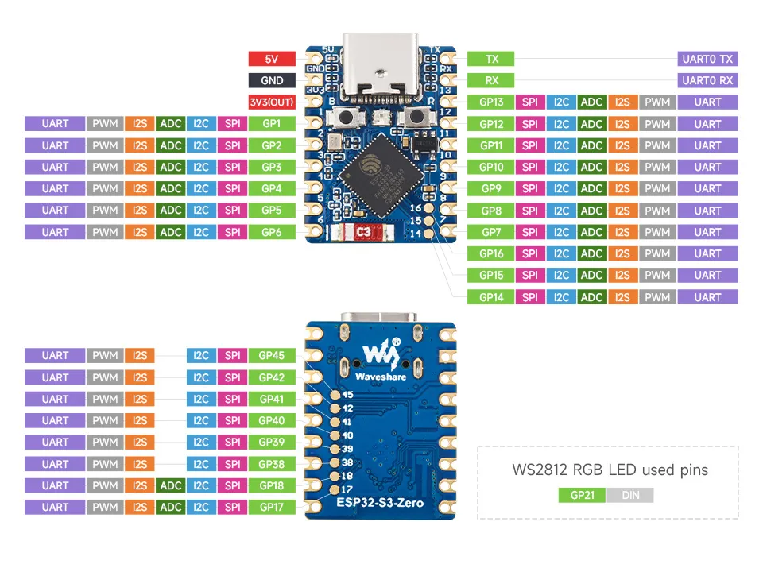
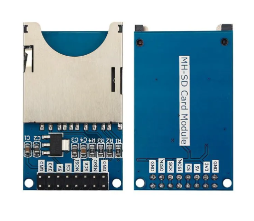

# Hardware assembly

This folder documents the exact controller and SD reader module used for the enclosure models in this repository.

> [!IMPORTANT]
> All 3D enclosure models in [`stl`](../stl) were designed around the hardware shown below. If you use a different ESP32-S3 board or SD reader module, check the board size, connector position, mounting points, card slot position, and USB access before printing the case.

## Reference hardware

### ESP32-S3 controller

The firmware targets an ESP32-S3 board. The enclosure models were made for the compact ESP32-S3 Zero-style controller shown in the image.

### SD reader module

The case cutouts and internal spacing were made for this SD reader module form factor.

## Assembly steps

1. Print the enclosure parts from the current [STL model version](../stl).
2. Prepare the ESP32-S3 controller and SD reader module shown above.
3. Wire the SD reader to the ESP32-S3 according to the pin table in the main [README](../README.md#pinout).
4. Connect the card detect line so that it reads `LOW` when a card is inserted.
5. Connect the WS2812 RGB LED to the configured LED GPIO if you use the case status indicator.
6. Flash the firmware and verify that the board starts, creates the Wi-Fi access point, and reports SD card status in the web interface.
7. Place the controller and SD reader into the printed bottom part.
8. Check that the USB connector, SD card slot, LED window, and card insertion path are not blocked.
9. Close the enclosure with the top part.

## Fit notes

- The STL models are not universal ESP32-S3 cases.
- The USB port and SD slot positions depend on the exact modules shown in this document.
- Test the electronics before final assembly so the case does not hide wiring or card detect problems.
- If you change the controller, SD reader, or connector orientation, adjust the 3D model before printing.
