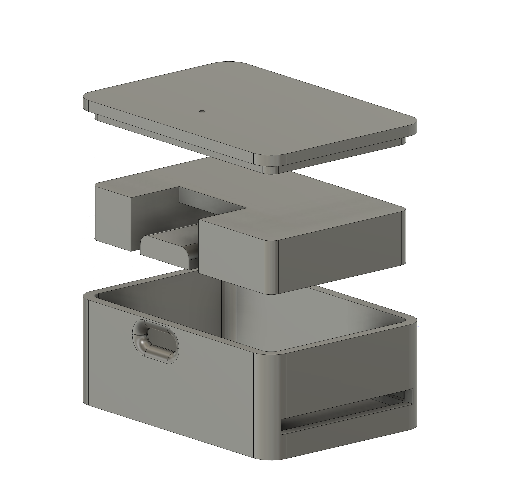

# STL enclosure models
This folder contains 3D-printable enclosure models for the ESP32 SD Reader project. There are two model versions available:

- [V1](v1) - the first enclosure version. It is kept for reference and compatibility, but is considered outdated.
- [V2](v2) - the newer and current enclosure version. It is more compact, stronger, more miniature, and recommended for new prints.

These models were designed for the specific ESP32-S3 controller and SD reader module shown in the [hardware assembly guide](../hardware). Check compatibility before printing if your modules are different.

## V1 - outdated version

V1 uses a three-part layout with a main case, a separate ESP32 holder, and a top cover. Use it if you already printed this version or need the older holder-based design.

## V2 - current version

V2 uses an improved two-part layout with a bottom part and a top cover. Compared with V1, the case is more compact, sturdier, more miniature, and easier to assemble. This is the best version to use for new builds.

## Files
- [V1 files and details(Older)](v1/README.md)
- [V2 files and details](v2/README.md)
