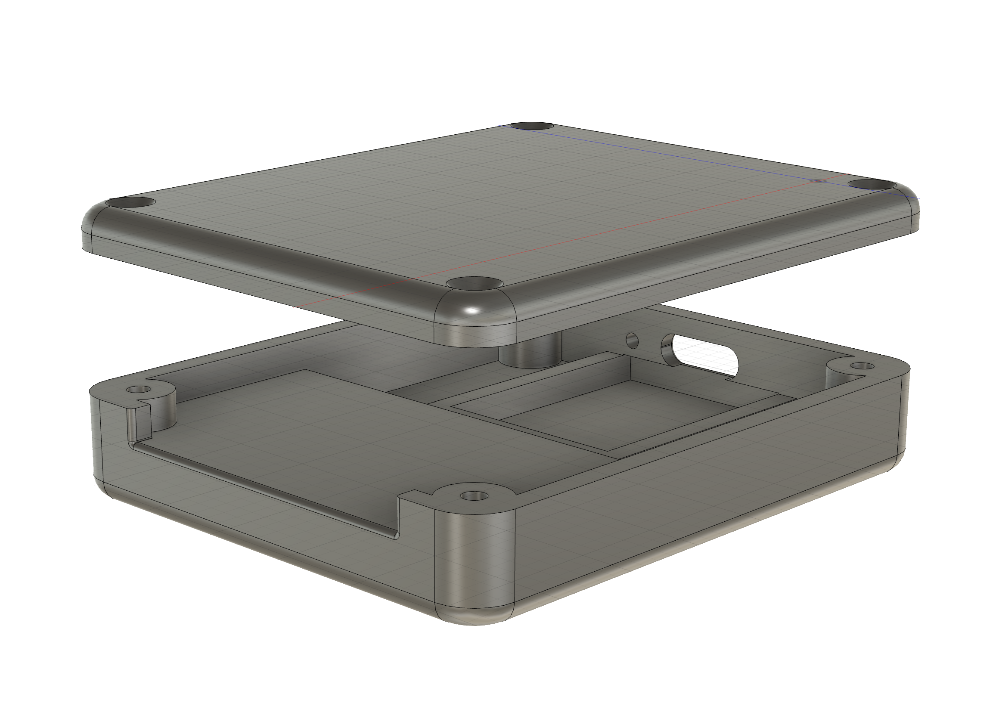

# V2 enclosure models

Current two-part enclosure version for new builds. Compared with V1, this case is more compact, sturdier, more miniature, and easier to assemble.

## Files
| File | Description |
| --- | --- |
| `Bottom.stl` | Lower enclosure body |
| `Top.stl` | Top cover |

## Assembly
1. Print both parts.
2. Place the ESP32 and SD reader components into the bottom part.
3. Close the enclosure with the top part.
